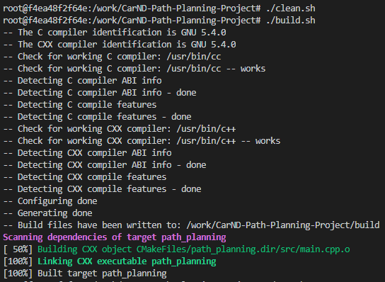
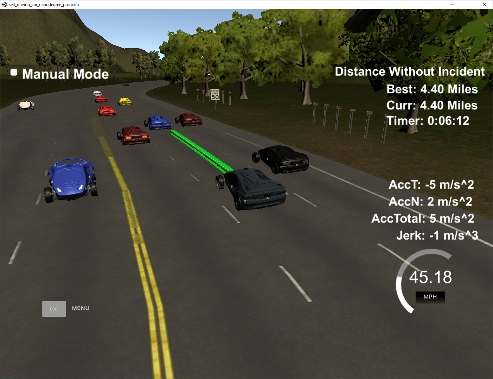

## Project Instructions and Rubric
# Path Planning
---
## Rubric Points
---
Here I will consider [the rubic points](https://review.udacity.com/#!/rubrics/1971/view) individually and describe how I addressed each point in my implementation.

##  The code compiles correctly  
  Code can be compiled error-free with cmake and make  
  

##  The car is able to drive at least 4.32 miles without incident  
  It is judged that there is no incident from the image below  
  

##  The car drives according to the speed limit  
  It is controlled by logic, and there was no phenomenon that exceeded the speed  

##  Max Acceleration and Jerk are not Exceeded  
  It was controlled by logic, and there was no phenomenon that exceeded the maximum acceleration and jerk  

##  Car does not have collisions  
  There was no collision phenomenon  

##  The car stays in its lane, except for the time between changing lanes  
  The car changed lanes within 3 seconds and stayed in one of the three lanes on the right, except when changing lanes

## The car is able to change lanes  
  The car can change lanes smoothly as needed  

##  There is a reflection on how to generate paths  
  1. Prediction  
    "Prediction" are made in lines 107-142 of main.cpp.  
    From the sensor fusion information, get if there is a vehicle in each lane near the vehicle.
    It also gets the speed of the lane in front of the vehicle.
  1. Behavior  
    "Behavior" are made in lines 144-166 of main.cpp.  
    The car decides which lane to drive.
    If you have a car in front of you and you can safely move to the next lane, you are changing lanes.
    If there is a car in front of the center lane and you can move in both the left and right lanes, a faster speed will be selected in that lane.
  1. Trajectory  
    "Trajectory" are made in lines 168-266 of main.cpp.  
    The spline calculations are performed using the last two points and three long-range points of the previous orbit.
    Also, the coordinates used are converted to local coordinates.
    For orbital stability Path track points are copied to new tracks for speed change constraints and improved continuity.
    The points you add will be added after the spline has been evaluated and converted to global coordinates.

